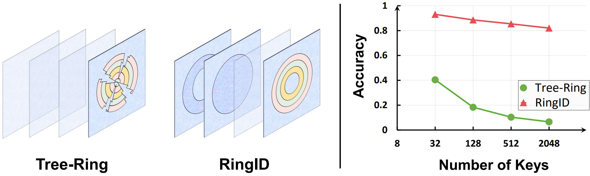
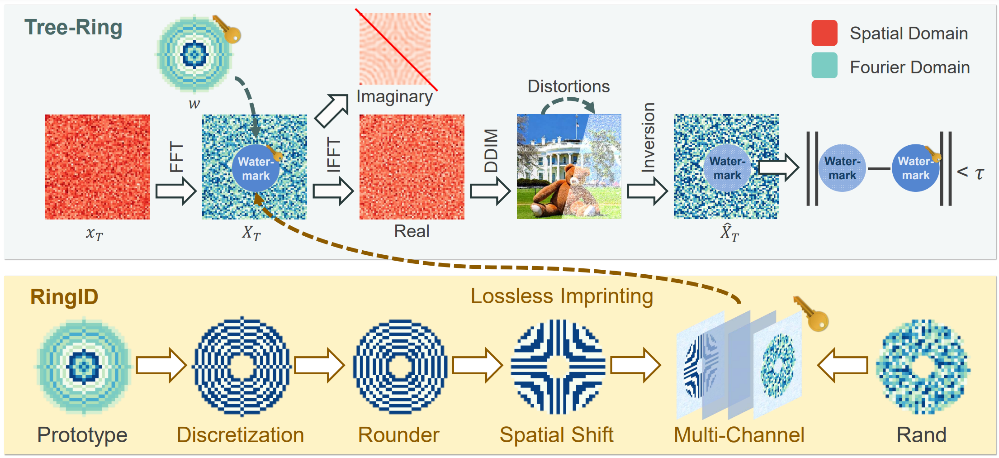

<div align="center">
<h1>RingID 🔍 </h1>
<h3>RingID: Rethinking Tree-Ring Watermarking for Enhanced Multi-Key Identification</h3>

[Hai Ci](https://scholar.google.com/citations?user=GMrjppAAAAAJ&hl=en)<sup>&#42;</sup>&nbsp; Pei Yang<sup>&#42;</sup>&nbsp; [Yiren Song](https://scholar.google.com/citations?user=L2YS0jgAAAAJ&hl=en&oi=ao)<sup>&#42;</sup>&nbsp; [Mike Zheng Shou](https://sites.google.com/view/showlab)

National University of Singapore

[Project Page](https://sites.google.com/view/ringid2?usp=sharing) | [Arxiv](http://arxiv.org/abs/2404.14055)

</div>



**RingID** presents a robust diffusion image watermarking approach to imprint multiple keys. It bases on the training-free approach Tree-Ring<sub>[1]</sub>, but significantly enhances in both watermark verification and multi-key identification. 


## Method

RingID identifies the limitations in Tree-Ring's design and suggests a series of approaches for enhanced distinguishability and robustness.


## Dependencies
- PyTorch == 1.13.0
- transformers == 4.23.1
- diffusers == 0.11.1
- datasets

Note: higher diffusers version may not be compatible with the DDIM inversion code.

## Usage

### Verification
```python
python verify.py --run_name verification --online
```

### Identification
```python
python identify.py --run_name identification --online
```


## Citation

```bibtex
@article{ci2024ringid,
  title={RingID: Rethinking Tree-Ring Watermarking for Enhanced Multi-Key Identification},
  author={Ci, Hai and Yang, Pei and Song, Yiren and Shou, Mike Zheng},
  journal={arXiv preprint arXiv:2404.14055},
  year={2024}
}
```

## Acknowledgement

[1] [Tree-ring watermarks: Fingerprints for diffusion images that are invisible and robust](https://github.com/YuxinWenRick/tree-ring-watermark)


