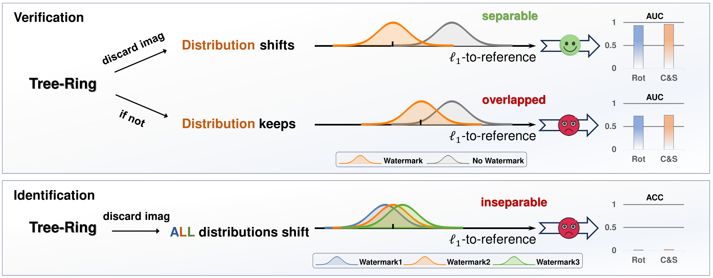

<h1>RingID 🔍 </h1>
<h3>RingID: Rethinking Tree-Ring Watermarking for Enhanced Multi-Key Identification</h3>

[Hai Ci](https://scholar.google.com/citations?user=GMrjppAAAAAJ&hl=en)&#42;&nbsp; Pei Yang&#42;&nbsp; [Yiren Song](https://scholar.google.com/citations?user=L2YS0jgAAAAJ&hl=en&oi=ao)&#42;&nbsp; [Mike Zheng Shou](https://sites.google.com/view/showlab)

National University of Singapore

[Project Page](https://sites.google.com/view/ringid2?usp=sharing) | [Preprint](https://drive.google.com/file/d/1HJOKRzPsGAnFzLOR-WTaf2d7C0s9eTaG/view)

**RingID** presents a robust diffusion image watermarking approach to imprint multiple keys. It bases on the training-free approach Tree-Ring[1], but significantly enhances in both watermark verification and multi-key identification. 

## Motivation

Tree-Ring demonstrates extraordinary robustness in watermark verification (detection). We are interested its power to distinguish between different keys.  We comprehensively evaluate Tree-Ring in identification and find that it doesn't have enough distinguishability to identify different keys. What's more, it is sensitive to various image transformations, and totally unable to cope with Rotation and Crop/Scale.  Further research shows that an overlooked operation "discarding the imaginary part" introduced in injection process empowers Tree-Ring extraordinary robustness, especially to rotation and cropping/scaling. However, it does not help identify different keys. This motivates us to rethink the limitations in Tree-Ring and devise stronger solutions.

## Method

RingID identifies the limitations in Tree-Ring's design and suggests a series of approaches for enhanced distinguishability and robustness.

## Qualitative 

## Reference
[1] Wen, Yuxin, et al. "Tree-ring watermarks: Fingerprints for diffusion images that are invisible and robust." arXiv preprint arXiv:2305.20030 (2023).

## Updates
- Code will be released soon.
